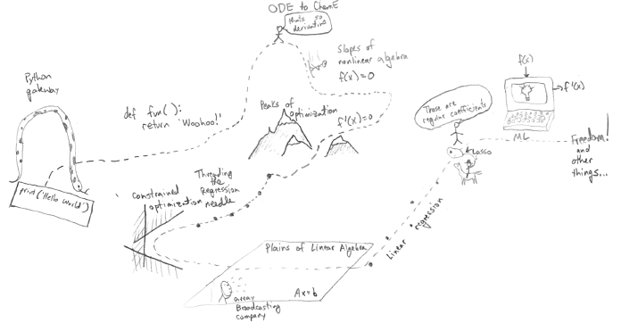

The pycse book
===================

The pycse book originated from a course I developed called Mathematical Modeling of Chemical Engineering Processes in the Master's program in Chemical Engineering at Carnegie Mellon University. These chapters came from the course I taught in 2019. These notes are lightly modified from that course.

It is an immersion course, designed for you to read and execute every cell in every notebook in the order prescribed. The course was designed for chemical engineers, and does use many examples from chemical engineering. It is pretty general though, and could be readily adapted to other disciplines. This course assumes you already know most of the math, and are here to learn how to solve problems with a computer. We review some math, but I don't think of this as a math course. It is a course on how to use Python to do computations in science and engineering (pycse).

This is the path this course takes. The gist is we start at `print("Hello world!")`, assuming you have little to no programming experience, and we navigate our way to an introduction to machine learning. We have to cover a lot of ground on this journey to make sure you have a solid foundation of understanding to know what is happening along the way. By the end, you should be able to use Python to solve the majority of science and engineering problems you would encounter in an undergraduate program.

You may find bugs or typos in these notes. You can report them by clicking on the GitHUB icon in the upper-right corner.
